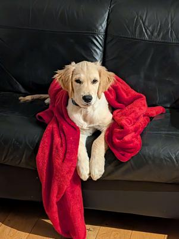
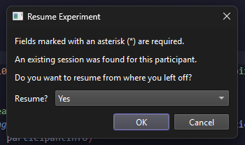

# Inducing Forgetting of Unwanted Memories Through Subliminal Reactivation

This was built for my Capstone research project. I was not able to fully conduct a laboratory EEG & GSR experiment with a significant sample size due to the ethics timeline taking over 3 months (too close to the Capstone deadline).

The full EEG & GSR acquisition modules are already nearly done, albeit parts are commented out/missing in this repo. All the stimuli images are from OASIS, GAPED and IAPS. For that reason, they are not included in this repository. If institutionally permitted, I would be happy to share the exact set I curated where I attempted to balance the levels of emotional aversiveness (as it may influence GSR readings) with participant comfort.

## Table of Contents

- [Research Overview](#research-overview)
- [Project Structure](#project-structure)
- [Tutorial](#tutorial)
- [Analysis and Plotting](#analysis-and-plotting)
- [Paradigm Walkthrough](#paradigm-walkthrough)
- [Figures and Findings](#figures-and-findings)
- [Experimental Information](#experimental-information)
- [Tested Systems/Versions](#tested-systemsversions)
- [Original Experiment](#original-experiment)
- [Extra Reading](#further-reading)

## Research Overview

A recent study has shown that it is possible to make people subliminally forget unwanted memories through the amnesic shadow, a phenomenon where suppressing a memory disrupts the retention of other memories reactivated around the same time. This has the potential to produce a potential new treatment for people suffering from conditions such as post-traumatic stress disorder (PTSD) by enabling memory suppression without requiring individuals to relive distressing experiences.

This project aims to expand on previous findings by incorporating electroencephalography (EEG) and galvanic skin response (GSR) to measure both neural and physiological markers of memory suppression. Owing to unfortunate delays, the physiological markers could not be implemented. The study reports behavioural data only. Five healthy adult volunteers learned 110 word–image pairs that were allocated to Think, No-think, Baseline, or Bystander conditions. In the critical Think/No-think (TNT) phase participants either retrieved (Think) or suppressed (No-think) the target image after being shown a cue word. During these trials, a bystander cue was flashed subliminally between forward- and backward-masks. Accuracy, Confidence, Gist, Identification, reaction time and a composite Recall-Score metric were recorded.

Although conclusions are limited by sample size and the absence of physiological markers, the study provides an open-source PsychoPy implementation of the modified TNT protocol and a fully documented pipeline along with frame-accurate subliminal stimulus delivery and crash safe state restoration. Future work should combine this paradigm with EEG and GSR and a larger sample size to provide further insight on the hypotheses.

## Project Structure

```pre
├── README.md
├── requirements.txt              # pip install -r requirements.txt
├── data/                         # participant CSV + state files
├── images/                       # stimuli images (user-supplied; not in repo)
├── masks/                        # mask images (run mask.py to generate masks from /images/)
├── bsusb/                        # BioSemi trigger helper
├── main.py                       # run this to launch experiment
├── phases/
    ├── learning.py               # learning phase logic
    ├── tnt_practice.py           # tnt practice phase logic
    ├── tnt.py                    # tnt phase logic
    ├── pair_refresher.py         # optional pair refresher phase logic
    └── final_recall.py           # final recall phase logic
├── utils/
    ├── config.py                 # testing flag (set testing=True to speed up program for debugging)
    ├── io.py                     # per-participant state JSONs, per-participant data CSVs
    ├── stimuli.py                # word-image table assembly (left descriptions of my experiment's images in the case of future project inheritance)
    └── timing.py                 # press Escape during pauses in the experiment to safely close the experiment (closing PsychoPy windows can be a pain)
├── scripts/
    ├── mask.py                   # generates masks from /images/
    ├── resize.py                 # resizes each image to 400px height while keeping aspect ratio
    ├── analysis/
        └── analysis.py           # analysis (GEE, ANOVA/RM-ANOVA, post-hoc (Holm), Bayes factors)
    ├── boxplots/
        ├── boxplotSingle.py      # plots a single boxplot
        └── boxplotDouble.py      # two metrics, side-by-side
    └── DATA/                     # means of different conditions from each experiment (data supplied from my own experiment)
└── figures/                      # figures and visual demonstrations of the experiment; only used for README.md
```

## Tutorial

### Step 1

```bash
python -m venv .venv
.venv\Scripts\activate # on windows
pip install --upgrade pip
pip install -r requirements.txt
```

### Step 2

(1) Add your target images. This repo does NOT include my images due to OASIS/GAPED/IAPS licensing concerns. Place x images, named 1.jpg, 2.jpg, ... x.jpg in /images. Modify program if x != 110. Example target image:


(2) Optional: resize your images to a consistent height. Running resize.py will resize all images in /images, default height 400px and keeps aspect ratio.

(3) Generate your masks. By running mask.py, all images in /images will generate equivalent mask images in /masks. Example mask:


### Step 3

```bash
python main.py
```

## Analysis and Plotting

To run the analysis and box-plot scripts;

### Step 1 -

Find /scripts/DATA/ and input the following CSVs (inspect data for the format):

- nas tnt run data - acc.csv
- nas tnt run data - con.csv
- nas tnt run data - gist.csv
- nas tnt run data - id.csv
- nas tnt run data - rs.csv
- tnt run data - acc.csv
- tnt run data - con.csv
- tnt run data - gist.csv
- tnt run data - id.csv
- tnt run data - rs.csv

### Step 2 -

Find each script (boxplotSingle.py, boxplotDouble.py, analysis.py), and edit the configs in each script. For example:

```py
# === CONFIG         ===
DATASET  = "tnt"       # "tnt" (amnesic shadow) or "nas" (no amnesic shadow)
RUN_BOTH = True        # True = render both TNT and NAS
COMPARE  = "acc-con"   # "acc-con" or "gist-id"
# ======================
```

### Step 3 -

```bash
python scripts\analysis\analysis.py
python scripts\boxplots\boxplotSingle.py
python scripts\boxplots\boxplotDouble.py
```

## Paradigm Walkthrough


The program follows a modified Think/No-Think paradigm. During the Think/No-Think phase, sandwich-masked bystander targets will be subliminally presented throughout each trial.
When you run main.py, the program will ask you to input your participant ID. In the case of the program crashing, you can use this to restore progress.




First phase is the Learning Phase. Participants will be shown each cue-target word-image pair one-by-one.


Next is the Test-Feedback loop. Participants go through the loop until they can achieve a certain accuracy in a given loop (I have it set at 65%). In the original experiment, participants were not allowed to progress onto the actual experiment if they could not pass the loop within a certain amount of tries.


Next is the Think/No-Think Practice phase. In this, it is important the examiner assesses whether the participant is actively suppressing recall during No-Think trials or not. When the cue (word) appears in green, participants must think about the associated target (image). You can repeat the practice phase if needed by changing the participant's state.json file in /data/.


Next is the actual Think/No-Think phase. The phase will be split up into blocks as to help participants with their focus. Rest periods are granted between each block and last 30 seconds as a minimum. Fixation crosses precede each trial in order to aid participant focus. During trials, a bystander target will be shown to the participant for ~16ms (1 frame @ 60hz); below the threshold of conscious recognition (along with sandwich masking to help prevent recognition).


The subliminal flash and sandwich masking proces is shown below (do note the frame counter is not present in the experiment):


After the Think/No-Think phase, there will be a prompt for an optional Pair Refresher Phase. Useful during experiments where there was too long of a break after the Think/No-Think phase.In the Final Recall Phase, participants see a target word and they must then attempt to recall what the associated cue word is. Examiners judge the accuracy and confidence (rated 1-5) as well as the gist and identification value for each attempt. Gist score is the proportion of identifiable features in the image the participant mentioned (i.e. "blue sky", "red dog" would score 0.4 if there were 5 features). Identification is a boolean value, whether the participant recalled the image or not.

Examiner inputs a value then presses Enter after filling out each line. If they are to input a wrong value or just want to change a previous value, they can press Backspace and modify their previous entries (per trial). Upon the first key press by the examiner for each trial, reaction time is measured and logged.


## Figures and Findings

Each metric was analysed using RM-ANOVA or GEE, depending on the data type. Post-hoc comparisons (Holm corrected) identified which condition pairs showed significant differences.

Hypotheses:
H1: Bystander No-think items will show statistically significant lower recall rates than Bystander Think and Bystander Baseline items.
H2: Think and Bystander Think items will yield the highest recall within their respective groups.
H3: Pairs that were never subliminally reactivated will show no statistically significant change in recall performance.

### Boxplot for Accuracy and Confidence across Bystander conditions


Lower No-think scores indicates reduced performance for No-think conditions. Implies that SIF (Suppression Induced Forgetting) occurred.

Post-hoc tests confirmed that Bystander No-think items were significantly lower in Accuracy than Baseline (p = .033). However, for Confidence, the difference between Bystander No-think and Baseline, while trending lower, was not statistically significant after Holm’s correction (p = .079).

### Boxplot for Gist and Identification across Bystander conditions


The RM-ANOVA for Gist revealed a borderline significant main effect of condition (F = 4.13, p = .059), but none of the No-Think pairwise contrasts survived Holm correction (all p’s > .1). In contrast, Identification GEE analysis revealed that, relative to Baseline, Identification was significantly higher for both No-think (p = .022) and Think (p = .001).

### Boxplot for Recall Score across Bystander conditions


Recall Score is a composite metric that attempts to balance examiner-rated metrics (accuracy and confidence) against slow recall.

Post-hoc comparison did not reach significance.

### Boxplot for Accuracy and Confidence across Normal conditions


Post-hoc pairwise comparisons (Holm-corrected) showed no significant differences between any of the three condition pairs.

### Boxplot for Gist and Identification across Normal conditions


Gist scores; all pairwise contrasts were non-significant. Identification GEE; neither No-think or Think differed from Baseline.

### Boxplot for Recall Score across Normal conditions


Recall Score; no post-hoc comparison reached significance.

### Analysis Table for Bystander conditions


### Analysis Table for Normal conditions


### Interpretation

In the normal TNT conditions, no reliable differences emerged on any metric, suggesting that, in this pilot, pure suppression did not produce forgetting.

By contrast, Bystander No-think items showed a consistent reduction in Accuracy and Confidence compared to both Bystander Baseline and Bystander Think (ANOVA p < .05; post-hoc p = .033). This selective impairment, absent in the standard TNT trials, suggests that subliminal flashing during active suppression may dampen the active memory traces, in line with the amnesic shadow hypothesis.

Identification and Recall-Score showed a significant drop in the Bystander No-think condition while Gist, oddly, merely trended lower. This pattern could hint at a dissociation between superficial recognition and detailed recall. However, given the very small sample (n = 5) and the exploratory nature of this study, these results should be regarded as preliminary. A larger sample, and ideally direct physiological measures, will be needed to determine whether these effects replicate or simply reflect chance variation or procedural idiosyncrasies.

Also interestingly, Identification scores were higher in both Bystander Think and No-think conditions relative to Baseline. This contrast, where accuracy-related metrics declined but recognition remained intact, may point to a dissociation between accessibility and memory quality. If this isn’t a byproduct of the small sample size and imperfect experiment environment, perhaps reactivated traces may become more available at a superficial level while simultaneously losing their detail or fidelity when suppression is engaged.

Although physiological measures were initially intended for this study, they are not present, and without EEG or GSR data, it is not possible to directly assess neural or arousal-related correlates of suppression or subliminal reactivation. Furthermore, the miniscule sample size of 5 participants is quite problematic. These limitations must be noted.

## Experimental Information

PsychoPy is frame-locked, but this repo does not include photodiode verification; expect small timing noise outside a lab. This is particularly relevant for this experiment, as keeping  bystander cues appearing subliminally (as close to 15ms as possible) is imperative.

Run this experiment on 60hz refresh rate, even if the monitor can handle 144hz, 240hz, 360hz, 500hz, etc. 1 frame is ~16ms.

Disable Game Mode and Freesync/G-Sync/whatever variable refresh rates. Keep monitor plugged into GPU if possible. Enable high performance power plans, especially if on a laptop.

Especially if the monitor is not OLED, attempt to keep the participant looking straight at the monitor, with a consistent viewing angle for all participants.

For optimal results, try to minimise delays between phases (while balancing the participant's focus) and seriously hammer in that they should not be substituting thoughts during No-Think trials. Furthermore, diagnostic questionnaires work wonders to assess how the participant is attempting recall suppression.

To skip to a phase for testing purposes, you can change the participant's state file to a certain stage.
e.g. if the file reads something like: {"currentPhase": "FinalRecall", "currentTrial": 14}, change it to any of these stages to start from there:
    - "Learning"
    - "TNTPractice"
    - "TNT"
    - "PairRefresher"
    - "FinalRecall"
    - "Completed"

What is NAS? NAS = “No Amnesic Shadow” — i.e., the standard TNT items without bystander flashes. In the scripts you’ll see both TNT and NAS datasets.

## Tested Systems/Versions

Tested on:

- Desktop, Windows 11 LTSC, Python 3.10, 1920x1080 24" 60Hz monitor running natively (HP 24f),       Ryzen 7800x3D, GTX 4070
- Desktop, Windows 11 LTSC, Python 3.10, 1920x1080 24" 360Hz monitor limited to 60hz (ASUS PG259QN), Ryzen 7800x3D, GTX 4070
- Laptop,  Fedora 40,       Python 3.10, 1920x1080 15.6" 240Hz monitor limited to 60hz (AORUS 15P),  i7-11800H,     GTX 3070 Mobile

Has worked fine with minimal issues -- timing checks via screen recordings and cameras (within reason, as I'm sure particularly high FPS cameras would prove to be accurate for this) are indicative only; a photodiode is recommended for true verification.

## Original Experiment

Z. Zhu, M. C. Anderson, and Y. Wang, “Inducing forgetting of unwanted memories through subliminal reactivation,” Nature Communications, vol. 13, no. 1, Oct. 2022, doi: <https://doi.org/10.1038/s41467-022-34091-1>.

## Further Reading

These papers were instrumental to my designing of the experiment paradigm:

D. Nardo and M. C. Anderson, “Everything you ever wanted to know about the think/no-think task, but forgot to ask,” Behavior research methods, vol. 56, Feb. 2024, doi: <https://doi.org/10.3758/s13428-024-02349-9>.

J. A. Harris, C.-T. . Wu, and M. G. Woldorff, “Sandwich masking eliminates both visual awareness of faces and face-specific brain activity through a feedforward mechanism,” Journal of Vision, vol. 11, no. 7, pp. 3–3, Jun. 2011, doi: <https://doi.org/10.1167/11.7.3>.

Z. M. Bergström, J. W. de Fockert, and A. Richardson-Klavehn, “ERP and behavioural evidence for direct suppression of unwanted memories,” NeuroImage, vol. 48, no. 4, pp. 726–737, Dec. 2009, doi: <https://doi.org/10.1016/j.neuroimage.2009.06.051>.

S. Hüttermann, D. Memmert, D. J. Simons, and O. Bock, “Fixation Strategy Influences the Ability to Focus Attention on Two Spatially Separate Objects,” PLoS ONE, vol. 8, no. 6, p. e65673, Jun. 2013, doi: <https://doi.org/10.1371/journal.pone.0065673>.

If you plan to extend this, I'm happy to advise on replication and EEG/GSR integration. Feel free to reach out.

Contact: <jakeykelley@gmail.com>
License: MIT

[Back to top](#table-of-contents)
